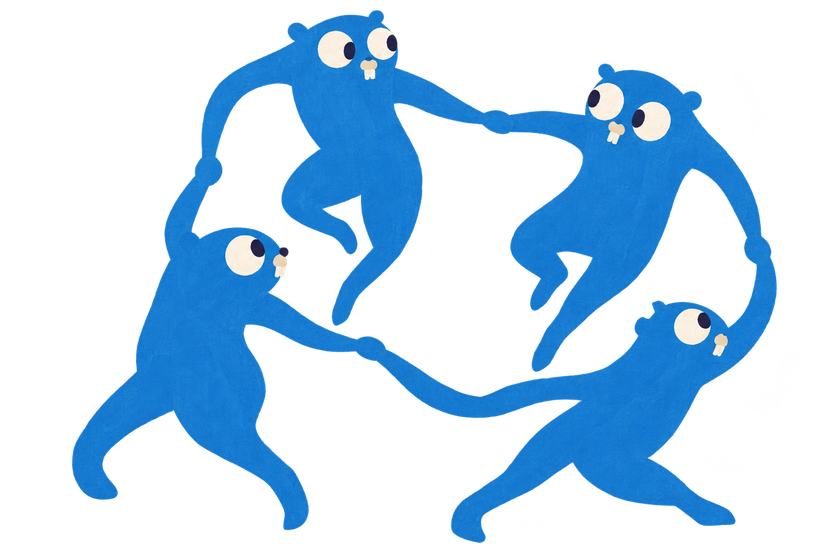
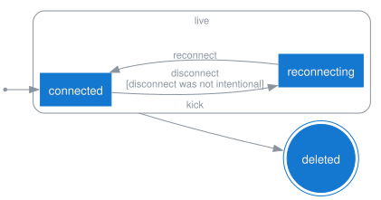
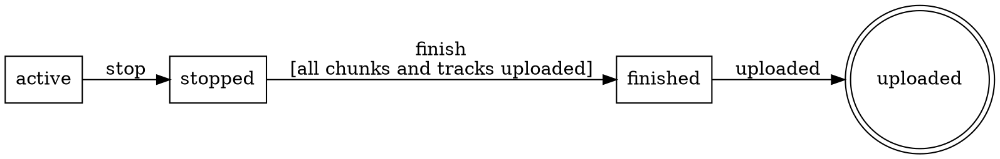
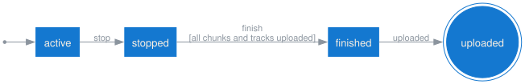

<p align="center">
  
</p>

# fsm

[](https://github.com/floatdrop/fsm/actions/workflows/ci.yml)
[](https://pkg.go.dev/github.com/floatdrop/fsm)
[](LICENSE)

A small finite state machine for Go, built around three ideas: **the caller owns the state**, **events carry typed payloads**, and **a machine is a set of rules** whose source and target are named separately so they cannot be swapped.

Requires **Go 1.27** — the API uses generic methods, which earlier versions reject with `method must have no type parameters`.

```go
type recState int32

const (
    recActive recState = iota
    recStopped
    recFinished
    recUploaded
)

// Events are prefixed ev so they never read as states: "stop" and "stopped"
// are one tense apart, which is not a difference worth relying on.
var (
    evRecStop   = fsm.Define[*recording]("stop")
    evRecFinish = fsm.Define[*recording]("finish")
    evRecUpload = fsm.Signal("uploaded")
)

var recordingFSM = fsm.MustNew("recording",
    fsm.Gauge(recActive, metrics.Inc(recActive), metrics.Dec(recActive)),
    fsm.Gauge(recStopped, metrics.Inc(recStopped), metrics.Dec(recStopped)),

    fsm.From(recActive).On(evRecStop).To(recStopped).Action(markStopped),
    fsm.From(recStopped).On(evRecFinish).To(recFinished).
        Guard("all chunks and tracks uploaded", uploadsSettled),
    fsm.From(recFinished).On(evRecUpload).To(recUploaded),
)

// The state lives in your struct. Fire mutates it in place.
err := recordingFSM.Fire(ctx, &r.state, evRecStop, r)
```

Firing an event the current state does not accept is an error, not a panic, and leaves the state untouched:

```go
err := recordingFSM.Send(ctx, &r.state, evRecUpload)
// fsm recording: no transition from active on uploaded
```

**Why the API is shaped this way** — state ownership, typed payloads, `Rule` as the single option type, guard semantics, and the known limitations — is in [docs/DESIGN.md](docs/DESIGN.md).

## Shared transitions

`FromEach` declares one transition per source. It is a fan-in shorthand and nothing else:

```go
fsm.FromEach(pcpConnected, pcpReconnecting).On(evPcpKick).To(pcpDeleted)
```

The sources are enumerated here and the machine learns nothing that relates them. When they really are related, name the set instead.

## Groups

`NewGroup` names a set of states, and the machine keeps the name. One transition declared against the group belongs to every member:

```go
type pcpState int32

const (
    pcpConnected pcpState = iota
    pcpReconnecting
    pcpDeleted
)

// A disconnect carries whether it was intentional, and why.
var (
    evPcpDrop      = fsm.Define[disconnect]("disconnect")
    evPcpReconnect = fsm.Signal("reconnect")
    evPcpKick      = fsm.Define[disconnect]("kick")
)

// Connected and reconnecting are both live, and both are kicked the same way.
var pcpLive = fsm.NewGroup("live", pcpConnected, pcpReconnecting)

var participantFSM = fsm.MustNew("participant",
    fsm.From(pcpConnected).On(evPcpDrop).To(pcpReconnecting).
        Guard("disconnect was not intentional", unintentional),
    fsm.From(pcpReconnecting).On(evPcpReconnect).To(pcpConnected),

    // One rule for every live state. A third live state would inherit it.
    fsm.FromGroup(pcpLive).On(evPcpKick).To(pcpDeleted),
)
```

The group is a cluster in the diagram, and `kick` leaves the cluster itself rather than any one state inside it:

<p align="center">
  
</p>

**A member that declares the event itself wins**, and the group still covers the rest:

```go
fsm.From(pcpReconnecting).On(evPcpKick).To(pcpAbandoned) // overrides the group
```

That override is the difference from `FromEach`. Enumerating sources at each transition means there is nothing to override and a new member silently inherits nothing — and nothing tells you which sites you forgot to update.

A group is *not* a state: it never appears in `States()`, a `*S` never holds one, and it expands to ordinary rows before `New` returns, so `Fire` neither knows about groups nor pays for them. Each row remembers where it came from:

```go
for _, e := range participantFSM.Edges() {
    if e.Group != "" {
        fmt.Printf("%v --%s--> %v inherited from %q\n", e.From, e.Event, e.To, e.Group)
    }
}
// connected --kick--> deleted inherited from "live"
// reconnecting --kick--> deleted inherited from "live"
```

`New` rejects a member that is not a state of the machine, two groups claiming one event for the same state, a group transition every member overrides, a repeated member, and a name reused for a different set of members.

Groups are most of what substates are used for and deliberately not all of it: no group hooks or `Gauge`, no nesting, no initial member. [docs/DESIGN.md](docs/DESIGN.md#groups-are-a-build-time-expansion) has the reasoning.

## Introspection

A machine can describe its own shape. `States`, `Edges`, `Terminals` and `Unreachable` report in declaration order — never map order — so they are stable enough to assert on:

```go
func TestRecordingShape(t *testing.T) {
    // Exactly one state should be a dead end.
    if got := recordingFSM.Terminals(); len(got) != 1 || got[0] != recUploaded {
        t.Errorf("terminals %v, want [uploaded]", got)
    }
    // Every state should be reachable from the initial one.
    if got := recordingFSM.Unreachable(recActive); len(got) != 0 {
        t.Errorf("unreachable states: %v", got)
    }
}
```

An unintended terminal state is a state something can get stuck in, and an unreachable state is a transition someone forgot to wire — both are worth a test rather than a re-read.

`Edges` returns the transition table itself, including each guard's description:

```go
for _, e := range recordingFSM.Edges() {
    fmt.Printf("%v --%s--> %v  %s\n", e.From, e.Event, e.To, e.Guard)
}
// active --stop--> stopped
// stopped --finish--> finished  all chunks and tracks uploaded
// finished --uploaded--> uploaded
```

`Edge.Event` is the trigger's name, for display. Two events can share a name, so use `e.Is(evRecStop)` to identify one.

### DOT

`DOT()` renders the machine as a Graphviz digraph, with terminal states drawn as double circles and guards on the edge labels:

```go
fmt.Print(recordingFSM.DOT())
```



Piped through Graphviz, that is:

<p align="center">
  
</p>

```sh
go run ./yourcmd | dot -Tsvg -o machine.svg
```

A [group](#groups) becomes a `subgraph cluster_…`, and a transition the whole group inherited becomes one arrow out of it instead of one per member:

```dot
compound=true;
subgraph "cluster_live" {
	label="live";
	style=rounded;
	"connected" [shape=box];
	"reconnecting" [shape=box];
}
"connected" -> "deleted" [label="kick", ltail="cluster_live"];
```

Per-member arrows are drawn instead wherever one boundary arrow would be a lie: a member that overrides the event, a group overlapping another so it cannot hold all its members in one cluster, or a target that is itself a member.

Output is deterministic — states, edges and groups are emitted in declaration order, never map order — so the DOT can be committed next to the code and reviewed in a diff when the machine changes.

## Benchmark

`Fire` does not allocate. Guards and actions are combined at construction, where the payload type is still known, and stored as a concrete `func(context.Context, A) error`; `Fire` asserts to that type and calls it with the payload directly, so nothing is boxed.

```sh
go test -bench Fire -benchmem -run '^$' ./...
```

```
goos: darwin
goarch: arm64
cpu: Apple M3 Pro
BenchmarkFire-12             35204294    33.74 ns/op    0 B/op    0 allocs/op
BenchmarkFireWithHooks-12    17826518    67.18 ns/op    0 B/op    0 allocs/op
```

One iteration is a round trip of two fires, one of them carrying an action, so a single `Fire` is roughly 17 ns. `FireWithHooks` is the same round trip on a machine declaring an entry hook, an exit hook and both payload hooks — that is what hooks cost, and a machine that declares none does not pay it: one flag checked at the top of `Fire` skips the hook block entirely.

The zero is the part that matters and is pinned by `TestFireDoesNotAllocate`; it runs without `-race`, which changes the allocation profile.

Single runs vary by around 10%, so re-measure with `-count=6` before quoting a different number.

## License

MIT — see [LICENSE](LICENSE).
