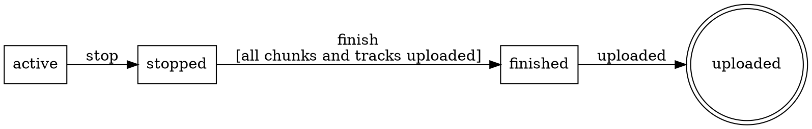

<p align="center">
  
</p>

# fsm

[](https://github.com/floatdrop/fsm/actions/workflows/ci.yml)
[](https://pkg.go.dev/github.com/floatdrop/fsm)
[](LICENSE)

A small finite state machine for Go, built around three ideas: **the caller owns the state**, **events carry typed payloads**, and **a machine is a set of rules** whose source and target are named separately so they cannot be swapped.

Requires **Go 1.27** — the API uses generic methods, which earlier versions reject with `method must have no type parameters`.

```go
type recState int32

const (
    recActive recState = iota
    recStopped
    recFinished
    recUploaded
)

// Events are prefixed ev so they never read as states: "stop" and "stopped"
// are one tense apart, which is not a difference worth relying on.
var (
    evRecStop   = fsm.Define[*recording]("stop")
    evRecFinish = fsm.Define[*recording]("finish")
    evRecUpload = fsm.Signal("uploaded")
)

var recordingFSM = fsm.MustNew("recording",
    fsm.Gauge(recActive, metrics.Inc(recActive), metrics.Dec(recActive)),
    fsm.Gauge(recStopped, metrics.Inc(recStopped), metrics.Dec(recStopped)),

    fsm.From(recActive).On(evRecStop).To(recStopped, fsm.WithAction(markStopped)),
    fsm.From(recStopped).On(evRecFinish).To(recFinished,
        fsm.WithGuard("all chunks and tracks uploaded", uploadsSettled)),
    fsm.From(recFinished).On(evRecUpload).To(recUploaded),
)

// The state lives in your struct. Fire mutates it in place.
err := recordingFSM.Fire(ctx, &r.state, evRecStop, r)
```

Firing an event the current state does not accept is an error, not a panic, and leaves the state untouched:

```go
err := recordingFSM.Send(ctx, &r.state, evRecUpload)
// fsm recording: no transition from active on uploaded
```

**Why the API is shaped this way** — state ownership, typed payloads, `Rule` versus `Option`, guard semantics, and the known limitations — is in [docs/DESIGN.md](docs/DESIGN.md).

## Introspection

A machine can describe its own shape. `States`, `Edges`, `Terminals` and `Unreachable` report in declaration order — never map order — so they are stable enough to assert on:

```go
func TestRecordingShape(t *testing.T) {
    // Exactly one state should be a dead end.
    if got := recordingFSM.Terminals(); len(got) != 1 || got[0] != recUploaded {
        t.Errorf("terminals %v, want [uploaded]", got)
    }
    // Every state should be reachable from the initial one.
    if got := recordingFSM.Unreachable(recActive); len(got) != 0 {
        t.Errorf("unreachable states: %v", got)
    }
}
```

An unintended terminal state is a state something can get stuck in, and an unreachable state is a transition someone forgot to wire — both are worth a test rather than a re-read.

`Edges` returns the transition table itself, including each guard's description:

```go
for _, e := range recordingFSM.Edges() {
    fmt.Printf("%v --%s--> %v  %s\n", e.From, e.Event, e.To, e.Guard)
}
// active --stop--> stopped
// stopped --finish--> finished  all chunks and tracks uploaded
// finished --uploaded--> uploaded
```

### DOT

`DOT()` renders the machine as a Graphviz digraph, with terminal states drawn as double circles and guards on the edge labels:

```go
fmt.Print(recordingFSM.DOT())
```



Piped through Graphviz, that is:

<p align="center">
  
</p>

```sh
go run ./yourcmd | dot -Tsvg -o machine.svg
```

Output is deterministic — states and edges are emitted in declaration order, never map order — so the DOT can be committed next to the code and reviewed in a diff when the machine changes.

## Benchmark

`Fire` does not allocate. Guards and actions are combined at construction, where the payload type is still known, and stored as a concrete `func(context.Context, A) error`; `Fire` asserts to that type and calls it with the payload directly, so nothing is boxed.

```sh
go test -bench Fire -benchmem -run '^$' ./...
```

```
goos: darwin
goarch: arm64
cpu: Apple M3 Pro
BenchmarkFire-12    29121236    40.52 ns/op    0 B/op    0 allocs/op
```

One iteration is a round trip of two fires, one of them carrying an action, so a single `Fire` is roughly 20 ns. The zero is the part that matters and is pinned by `TestFireDoesNotAllocate`; it runs without `-race`, which changes the allocation profile.

Single runs vary by around 10%, so re-measure with `-count=6` before quoting a different number.

## Status

Prototype. The API is not settled — in particular `Option[A]` and the hook signature.

## License

MIT — see [LICENSE](LICENSE).
