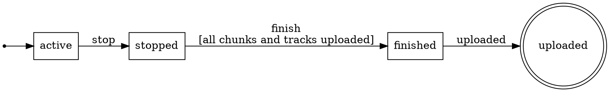

<p align="center">
  
</p>

# fsm

[](https://github.com/floatdrop/fsm/actions/workflows/ci.yml)
[](https://pkg.go.dev/github.com/floatdrop/fsm)
[](LICENSE)
[](https://floatdrop.github.io/awesome-go/#floatdrop--fsm)

A small finite state machine for Go. The caller owns the state, events carry typed payloads, and a machine is a set of rules whose source and target are named in separate calls so they cannot be swapped.

Requires Go 1.27. The API uses generic methods, which earlier versions reject with `method must have no type parameters`.

```go
type recState int32

const (
    recActive recState = iota
    recStopped
    recFinished
    recUploaded
)

// Events are prefixed ev so an event and a state never differ by tense alone.
var (
    evRecStop   = fsm.Define[*recording]("stop")
    evRecFinish = fsm.Define[*recording]("finish")
    evRecUpload = fsm.Signal("uploaded")
)

var recordingFSM = fsm.MustNew("recording",
    fsm.Initial(recActive),
    fsm.Gauge(recActive, metrics.Inc(recActive), metrics.Dec(recActive)),
    fsm.Gauge(recStopped, metrics.Inc(recStopped), metrics.Dec(recStopped)),

    fsm.From(recActive).On(evRecStop).To(recStopped).Action(markStopped),
    fsm.From(recStopped).On(evRecFinish).To(recFinished).
        Guard("all chunks and tracks uploaded", uploadsSettled),
    fsm.From(recFinished).On(evRecUpload).To(recUploaded),
)

// The state lives in your struct. Fire mutates it in place and reports the move.
tr, err := recordingFSM.Fire(ctx, &r.state, evRecStop, r)
// tr.From == recActive, tr.To == recStopped
```

An event the current state does not accept returns an error, never panics, and leaves the state untouched:

```go
_, err := recordingFSM.Send(ctx, &r.state, evRecUpload)
// fsm recording: no transition from active on uploaded
```

Every fire-time failure is a typed error carrying the edge: `*NoTransitionError`, `*GuardError`, `*ActionError`, or `*StateChangedError` when a guard or action wrote the state through an aliased payload, reported ahead of any error that callback also returned (kept in its `Err`, but not unwrapped, since the state did move). `GuardError` and `ActionError` unwrap to the guard's or action's own error, so a sentinel can be matched with `errors.Is`. A nil state pointer or the zero `Event` is a plain error, since it is a bug in the caller.

The reasoning behind the API (state ownership, typed payloads, `Rule` as the single option type, guard semantics, known limitations) is in [docs/DESIGN.md](docs/DESIGN.md).

## Shared transitions

`FromEach` declares the same transition from several sources:

```go
fsm.FromEach(pcpConnected, pcpReconnecting).On(evPcpKick).To(pcpDeleted)
```

The machine records one edge per source and nothing that relates them. When the sources are related, use a group.

## Groups

`NewGroup` names a set of states. A transition declared on the group applies to every member:

```go
type pcpState int32

const (
    pcpConnected pcpState = iota
    pcpReconnecting
    pcpDeleted
)

// A disconnect carries whether it was intentional, and why.
var (
    evPcpDrop      = fsm.Define[disconnect]("disconnect")
    evPcpReconnect = fsm.Signal("reconnect")
    evPcpKick      = fsm.Define[disconnect]("kick")
)

// Connected and reconnecting are both live, and both are kicked the same way.
var pcpLive = fsm.NewGroup("live", pcpConnected, pcpReconnecting)

var participantFSM = fsm.MustNew("participant",
    fsm.Initial(pcpConnected),
    fsm.From(pcpConnected).On(evPcpDrop).To(pcpReconnecting).
        Guard("disconnect was not intentional", unintentional),
    fsm.From(pcpReconnecting).On(evPcpReconnect).To(pcpConnected),

    // One rule for every live state, including any added later.
    fsm.FromGroup(pcpLive).On(evPcpKick).To(pcpDeleted),
)
```

In the diagram the group is a cluster, and `kick` leaves the cluster rather than any one state inside it:

<p align="center">
  
</p>

A member that declares the event itself overrides the group rule. The other members keep the inherited one:

```go
fsm.From(pcpReconnecting).On(evPcpKick).To(pcpAbandoned) // overrides the group
```

This override is what `FromEach` cannot do. With enumerated sources there is nothing to override, and a state added later has to be added to every `FromEach` call by hand.

A group is not a state. It never appears in `States()`, a `*S` never holds one, and it expands into ordinary rows before `New` returns, so `Fire` does not know about groups and pays nothing for them. Each expanded row records its group:

```go
for _, e := range participantFSM.Edges() {
    if e.Group != "" {
        fmt.Printf("%v --%s--> %v inherited from %q\n", e.From, e.Event(), e.To, e.Group)
    }
}
// connected --kick--> deleted inherited from "live"
// reconnecting --kick--> deleted inherited from "live"
```

`New` rejects a member that is not a state of the machine, two groups claiming one event for the same state, a group transition every member overrides, a repeated member, and a name reused for a different set of members.

Groups cover most of what substates are used for, but not all of it: there are no group hooks or `Gauge`, no nesting, and no initial member. The reasons are in [docs/DESIGN.md](docs/DESIGN.md#groups-are-a-build-time-expansion).

## Hooks

`OnEnter` and `OnExit` run bookkeeping that cannot fail around the assignment, and `Gauge` pairs an increment on entry with a decrement on exit. `OnTransition` runs after every transition, for an audit log or a trace:

```go
fsm.OnTransition(func(_ context.Context, tr fsm.Transition[recState]) {
    log.Info("recording", "from", tr.From, "to", tr.To, "on", tr.Event())
}),
```

A transition hook observes and must not fire the machine itself; entry hooks may. A hook sees the transition, not the payload, because a state can be entered by events carrying different types. `OnEnterVia` and `OnExitVia` name the event, which fixes the payload type (`New` rejects one that no transition on that event can trigger), and `GaugeWith` is `Gauge` for a counter that lives in the payload.

The order inside `Fire` is fixed: lookup, guards, action, the check that neither wrote the state, exit hooks, assignment, transition hooks, entry hooks. Everything that can fail does so before the assignment, so a hook never runs for a transition that did not happen.

## Introspection

`States`, `Events`, `Edges`, `Terminals` and `Unreachable` report the machine's shape in declaration order, so tests can assert on them:

```go
func TestRecordingShape(t *testing.T) {
    // Only uploaded is a dead end.
    if got := recordingFSM.Terminals(); len(got) != 1 || got[0] != recUploaded {
        t.Errorf("terminals %v, want [uploaded]", got)
    }
    // Every state is reachable from active.
    if got := recordingFSM.Unreachable(recActive); len(got) != 0 {
        t.Errorf("unreachable states: %v", got)
    }
}
```

An unintended terminal state is somewhere a value can get stuck, and an unreachable state usually means a missing transition. Both are cheap to test.

`Initial` declares where a fresh instance starts, as both machines above do. The machine still holds no state, but `New` then rejects a state nothing reaches from the start, or a start with no way out, so the reachability check above is already a build error:

```go
fsm.MustNew("recording",
    fsm.Initial(recActive),
    fsm.From(recActive).On(evRecStop).To(recStopped),
    fsm.From(recFinished).On(evRecUpload).To(recUploaded), // nothing reaches finished
)
// panic: fsm recording: states [finished uploaded] cannot be reached from initial state active
```

`Edges` returns the transition table, including guard descriptions:

```go
for _, e := range recordingFSM.Edges() {
    fmt.Printf("%v --%s--> %v  %s\n", e.From, e.Event(), e.To, e.Guard)
}
// active --stop--> stopped
// stopped --finish--> finished  all chunks and tracks uploaded
// finished --uploaded--> uploaded
```

`Edge.Event()` is the trigger's name and is meant for display. Names are not unique, so identify a trigger with `e.Is(evRecStop)`.

### DOT

`DOT` renders the machine as a Graphviz digraph. The initial state is pointed at from a dot, terminal states are double circles, and guards appear in edge labels:

```go
fmt.Print(recordingFSM.DOT())
```



```sh
go run ./yourcmd | dot -Tsvg -o machine.svg
```

<p align="center">
  
</p>

A [group](#groups) becomes a cluster, and a transition every member inherited is drawn once from the cluster boundary:

```dot
compound=true;
subgraph "cluster_live" {
	label="live";
	style=rounded;
	"connected" [shape=box];
	"reconnecting" [shape=box];
}
"connected" -> "deleted" [label="kick", ltail="cluster_live"];
```

Per-member arrows are used when a boundary arrow would be wrong: a member overrides the event, the group overlaps another and cannot hold all its members in one cluster, or the target is itself a member.

Output follows declaration order, so the DOT can be committed next to the code and diffed when the machine changes.

## Benchmark

`Fire` does not allocate. Guards and actions are combined at construction, where the payload type is known, and stored as a concrete `func(context.Context, A) error`. `Fire` asserts back to that type and passes the payload directly, so nothing is boxed.

```sh
go test -bench Fire -benchmem -run '^$' ./...
```

```
goos: darwin
goarch: arm64
cpu: Apple M3 Pro
BenchmarkFire-14             37311288    32.04 ns/op    0 B/op    0 allocs/op
BenchmarkFireWithHooks-14    18780339    63.72 ns/op    0 B/op    0 allocs/op
```

One iteration is a round trip of two fires, one with an action, so a single `Fire` is about 16 ns. `BenchmarkFireWithHooks` runs the same round trip on a machine with an entry hook, an exit hook and both payload hooks. A machine that declares no hooks skips the hook block on one flag check and pays none of that.

`TestFireDoesNotAllocate` pins the zero allocations. It runs without `-race`, which changes the allocation profile.

Single runs vary by about 10%. Re-measure with `-count=6` before updating these numbers.

## License

MIT, see [LICENSE](LICENSE).
