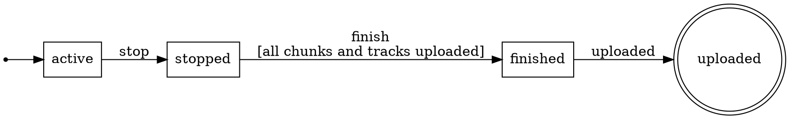

<p align="center">
  
</p>

# fsm

[](https://github.com/floatdrop/fsm/actions/workflows/ci.yml)
[](https://pkg.go.dev/github.com/floatdrop/fsm)
[](https://github.com/floatdrop/fsm/actions/workflows/ci.yml)
[](LICENSE)
[](https://floatdrop.github.io/awesome-go/#floatdrop--fsm)

A finite state machine for Go, in one package with no dependencies.

- **The caller owns the state.** `Fire` takes a `*S` that lives in your struct, so a serialized state has no second copy in the machine to drift from.
- **Events carry typed payloads.** `Event[time.Time]` fires only with a `time.Time`. No `any`, no assertions.
- **Source and target are separate calls.** `From(a).On(ev).To(b)` — two adjacent arguments of one type can be swapped silently; two calls cannot.
- **`Fire` does not allocate** and never panics. Definition errors come from `New` at startup.

```sh
go get github.com/floatdrop/fsm
```

Requires **Go 1.27**: the API uses generic methods, which earlier versions reject with `method must have no type parameters`.

## Quick start

A complete program.

```go
package main

import (
	"context"
	"errors"
	"fmt"
	"time"

	"github.com/floatdrop/fsm"
)

// States are any comparable type. int32 here so the state can sit in a
// protobuf enum field and survive a snapshot.
type recState int32

const (
	recActive recState = iota
	recStopped
	recFinished
	recUploaded
)

func (s recState) String() string {
	return [...]string{"active", "stopped", "finished", "uploaded"}[s]
}

// The state lives in your struct. The machine never holds a copy.
type recording struct {
	state          recState
	stoppedAt      time.Time
	pendingUploads int
}

// Events are prefixed ev so they never read as states: "stop" the event beside
// "stopped" the state is one tense apart. The payload is the aggregate itself,
// so guards and actions see exactly what the caller has.
var (
	evRecStop   = fsm.Define[*recording]("stop")
	evRecFinish = fsm.Define[*recording]("finish")
	evRecUpload = fsm.Signal("uploaded")
)

// A guard rejects with a sentinel, so a caller can tell "not yet, retry later"
// from "not allowed at all" without parsing strings.
var errUploadPending = errors.New("still uploading")

var recordingFSM = fsm.MustNew("recording",
	fsm.Initial(recActive),

	fsm.From(recActive).On(evRecStop).To(recStopped).
		Action(func(_ context.Context, r *recording) error {
			r.stoppedAt = time.Now()
			return nil
		}),

	fsm.From(recStopped).On(evRecFinish).To(recFinished).
		Guard("all chunks and tracks uploaded", func(_ context.Context, r *recording) error {
			if r.pendingUploads != 0 {
				return fmt.Errorf("%w: %d left", errUploadPending, r.pendingUploads)
			}
			return nil
		}),

	fsm.From(recFinished).On(evRecUpload).To(recUploaded),
)

func main() {
	ctx := context.Background()
	r := &recording{pendingUploads: 2}

	// Fire moves the state in place and reports the transition it made.
	tr, _ := recordingFSM.Fire(ctx, &r.state, evRecStop, r)
	fmt.Println(tr.From, "->", tr.To, "on", tr.Event())

	// The guard refuses; the state does not move.
	_, err := recordingFSM.Fire(ctx, &r.state, evRecFinish, r)
	fmt.Println(err)
	fmt.Println("retryable:", errors.Is(err, errUploadPending), "| state:", r.state)

	// An event this state does not accept is an error, never a panic.
	_, err = recordingFSM.Send(ctx, &r.state, evRecUpload)
	fmt.Println(err)

	r.pendingUploads = 0
	_, _ = recordingFSM.Fire(ctx, &r.state, evRecFinish, r)
	_, _ = recordingFSM.Send(ctx, &r.state, evRecUpload)
	fmt.Println("final:", r.state)
}
```

```
active -> stopped on stop
fsm recording: transition stopped --finish--> finished rejected by guard "all chunks and tracks uploaded": still uploading: 2 left
retryable: true | state: stopped
fsm recording: no transition from stopped on uploaded
final: uploaded
```

Every section below refers back to this machine.

## Declaring a machine

`New` returns a machine or *every* mistake it found. `MustNew` panics instead — right for a package-level variable, so a bad definition fails at startup rather than at fire time.

Each of these returns a `Rule[S]`, the single option type. Rules are plain values, reusable across machines.

| Rule | Declares |
| --- | --- |
| `From(a).On(ev).To(b)` | one transition |
| `FromEach(a, b).On(ev).To(c)` | the same transition from several sources |
| `FromGroup(g).On(ev).To(c)` | a transition inherited by every member of a [group](#groups) |
| `Initial(a)` | where a fresh instance starts |
| `OnEnter(s, h)` / `OnExit(s, h)` | [hooks](#hooks) around the assignment |
| `OnTransition(h)` | a hook on every transition |
| `OnEnterVia(s, ev, h)` / `OnExitVia(s, ev, h)` | hooks that see the payload |
| `Gauge(s, inc, dec)` / `GaugeWith(s, inc, dec)` | a counter of how many things are in `s` |
| `NewGroup(name, a, b)` | a [group](#groups), usable as a rule on its own |
| `Rules(...)` | several rules as one value |

### Guards and actions

`Guard` and `Action` are methods on the transition, not extra arguments to `To`:

```go
fsm.From(recStopped).On(evRecFinish).To(recFinished).
	Guard("all chunks and tracks uploaded", uploadsSettled).
	Action(sealManifest)
```

**Guards** run in registration order and the first rejection wins. The description is the static condition — it names the guard in the error and labels the edge in [`DOT`](#dot); the returned error is why it failed *this time*, and `GuardError` unwraps to it, so `errors.Is(err, errUploadPending)` works.

An **action** runs after every guard passed and before the state moves; if it fails, nothing is assigned and no hook runs.

Both receive the payload at its declared type.

### Several sources

`FromEach` declares one transition from each of several states:

```go
fsm.FromEach(pcpConnected, pcpReconnecting).On(evPcpKick).To(pcpDeleted)
```

One edge per source, with nothing relating them. Use a [group](#groups) when the sources *are* related, or when a state added later should inherit the rule.

### Initial state

`Initial` records where a fresh instance starts — the machine still holds no state. It buys two build-time checks: no unreachable state, and no start with no way out.

```go
fsm.MustNew("recording",
	fsm.Initial(recActive),
	fsm.From(recActive).On(evRecStop).To(recStopped),
	fsm.From(recFinished).On(evRecUpload).To(recUploaded), // nothing reaches finished
)
// panic: fsm recording: states [finished uploaded] cannot be reached from initial state active
```

It is also what [`DOT`](#dot) draws the start marker from.

## Firing

```go
tr, err := recordingFSM.Fire(ctx, &r.state, evRecStop, r) // with a payload
tr, err := recordingFSM.Send(ctx, &r.state, evRecUpload)  // for events declared with Signal
```

`Fire` returns the `Transition` it made: `tr.From`, `tr.To`, and `tr.Event()` for display. Names are not unique, so branch with `tr.Is(evRecStop)`, never on the string.

To ask without firing:

```go
err := m.Check(ctx, from, ev, payload) // nil, or the same error Fire would return
ok := m.Can(ctx, from, ev, payload)    // Check with the reason discarded
to, ok := m.To(from, ev)               // the target, ignoring guards
```

`Check` evaluates guards but runs no action and no hook.

A machine is immutable once `New` returns, so one value serves every goroutine that owns a state, with no lock. Hooks are shared, so whatever they touch is yours to synchronize.

### Errors

Every fire-time failure is a typed error carrying the edge. Match with `errors.AsType`:

| Error | Means | State |
| --- | --- | --- |
| `*NoTransitionError[S]` | this state does not accept this event | untouched |
| `*GuardError[S]` | a guard rejected; unwraps to the guard's error | untouched |
| `*ActionError[S]` | the action failed; unwraps to the action's error | untouched |
| `*StateChangedError[S]` | a guard or action wrote the state through an aliased payload | whatever the callback left |

A nil state pointer or the zero `Event` is a plain error — a caller bug, not a machine event.

`StateChangedError` catches the aliasing trap: when the payload *is* the struct holding the state, a guard or action that writes `r.state` itself would leave you running from a state the machine never assigned. It is reported ahead of any error the callback also returned, which is kept in `Err` but deliberately **not** unwrapped — a guard's sentinel means "state untouched, retry", and matching it here would re-fire from the wrong source. Read it with `errors.AsType`.

## Hooks

Hooks run bookkeeping around the assignment. They return nothing: everything that can fail does so before the state moves, so a hook never runs for a transition that did not happen.

```go
fsm.OnEnter(recStopped, func(_ context.Context, tr fsm.Transition[recState]) { ... })
fsm.OnExit(recActive, func(_ context.Context, tr fsm.Transition[recState]) { ... })

fsm.OnTransition(func(_ context.Context, tr fsm.Transition[recState]) {
	log.Info("recording", "from", tr.From, "to", tr.To, "on", tr.Event())
})
```

The order inside `Fire` is fixed:

> lookup → guards → action → the check that neither wrote the state → `OnExit(from)` → **assignment** → `OnTransition` → `OnEnter(to)`

`OnTransition` precedes the entry hooks so an entry hook that fires again is logged after its cause; the price is that a transition hook must observe and not fire. A self-transition `From(a).On(ev).To(a)` is UML's *external* kind — it runs exit then entry.

### Gauges

`Gauge` pairs an increment on entry with a decrement on exit. A "how many are in state X" counter otherwise lives as a `+=` and a `-=` at every call site that moves the state, and drifts the moment one is missed:

```go
fsm.Gauge(recStopped, metrics.Inc(recStopped), metrics.Dec(recStopped))
```

Hooks cannot fail and none runs before the assignment is certain, so the two halves cannot come apart.

`GaugeWith` is the same for a counter that lives in the payload. It is declared once per state and expands to a hook on every event entering and leaving it, which requires all of them to carry the same payload type; `New` reports the offending transition rather than silently skipping an edge.

### Typed hooks

A plain `Hook` sees the transition but not the payload, because a state can be entered by events carrying different types. `OnEnterVia` and `OnExitVia` name the event, which fixes the type:

```go
fsm.OnExitVia(recActive, evRecStop, func(_ context.Context, tr fsm.Transition[recState], r *recording) {
	log.Info("stopping", "pending", r.pendingUploads)
})
```

`New` rejects one that no transition on that event could trigger. Via hooks run after the plain hooks of the same state.

## Groups

`NewGroup` names a set of states. A transition declared on the group applies to every member:

```go
type pcpState int32

const (
	pcpConnected pcpState = iota
	pcpReconnecting
	pcpDeleted
	pcpAbandoned
)

func (s pcpState) String() string {
	return [...]string{"connected", "reconnecting", "deleted", "abandoned"}[s]
}

// A disconnect carries why it happened, so the reason cannot be lost between
// the caller and the guard that reads it.
type disconnect struct {
	intentional bool
	reason      string
}

var (
	evPcpDrop      = fsm.Define[disconnect]("disconnect")
	evPcpReconnect = fsm.Signal("reconnect")
	evPcpKick      = fsm.Define[disconnect]("kick")
)

// Connected and reconnecting are both live, and both are kicked the same way.
var pcpLive = fsm.NewGroup("live", pcpConnected, pcpReconnecting)

var participantFSM = fsm.MustNew("participant",
	fsm.Initial(pcpConnected),

	fsm.From(pcpConnected).On(evPcpDrop).To(pcpReconnecting).
		Guard("disconnect was not intentional", func(_ context.Context, d disconnect) error {
			if d.intentional {
				return fmt.Errorf("left on purpose: %s", d.reason)
			}
			return nil
		}),
	fsm.From(pcpReconnecting).On(evPcpReconnect).To(pcpConnected),

	// One rule for every live state, including any added later.
	fsm.FromGroup(pcpLive).On(evPcpKick).To(pcpDeleted),
)
```

<p align="center">
  
</p>

A member that declares the event itself **overrides** the group rule; the others keep the inherited one:

```go
fsm.From(pcpReconnecting).On(evPcpKick).To(pcpAbandoned) // overrides the group
```

That override is what `FromEach` cannot do, and the reason to reach for a group.

A group is **not a state**: it never appears in `States()`, a `*S` never holds one, and it expands into ordinary rows before `New` returns, so `Fire` pays nothing for it. Each row records where it came from:

```go
for _, e := range participantFSM.Edges() {
	if e.Group != "" {
		fmt.Printf("%v --%s--> %v inherited from %q\n", e.From, e.Event(), e.To, e.Group)
	}
}
// connected --kick--> deleted inherited from "live"
// reconnecting --kick--> deleted inherited from "live"
```

`New` rejects an unknown member, a repeated one, a name reused for different members, two groups claiming one event for the same state, and a group transition every member overrides.

Groups cover most of what substates are for, but not all: no group hooks or `Gauge`, no nesting, no initial member. Why, in [docs/DESIGN.md](docs/DESIGN.md#groups-are-a-build-time-expansion).

## Introspection

`States`, `Events`, `Edges`, `Groups`, `Terminals`, `Unreachable` and `Initial` report the machine's shape in declaration order, so the output is stable and worth asserting on:

```go
func TestRecordingShape(t *testing.T) {
	// Only uploaded is a dead end.
	if got := recordingFSM.Terminals(); len(got) != 1 || got[0] != recUploaded {
		t.Errorf("terminals %v, want [uploaded]", got)
	}
	// Every state is reachable from active.
	if got := recordingFSM.Unreachable(recActive); len(got) != 0 {
		t.Errorf("unreachable states: %v", got)
	}
}
```

An unintended terminal is somewhere a value gets stuck; an unreachable state usually means a missing transition. Declaring `Initial` turns the second check into a build error.

`Edges` returns the table, guard descriptions included:

```go
for _, e := range recordingFSM.Edges() {
	fmt.Printf("%v --%s--> %v  %s\n", e.From, e.Event(), e.To, e.Guard)
}
// active --stop--> stopped
// stopped --finish--> finished  all chunks and tracks uploaded
// finished --uploaded--> uploaded
```

`Edge.Event()` and `Transition.Event()` are names, for display; identify a trigger with `e.Is(evRecStop)`.

### DOT

`DOT` renders a Graphviz digraph: a dot points at the initial state, terminals are double circles, guards appear in edge labels, and a [group](#groups) becomes a cluster with inherited transitions drawn once from the boundary.

```sh
go run ./yourcmd | dot -Tsvg -o machine.svg
```



<p align="center">
  
</p>

A boundary arrow is drawn only when it would be accurate — per-member arrows are used when a member overrides the event, when overlapping groups cannot both hold all their members, or when the target is itself a member. Output follows declaration order, so it can be committed next to the code and diffed.

## Performance

Guards and actions are combined at construction, where the payload type is still known, and stored as a concrete `func(context.Context, A) error`. `Fire` asserts back to that type and passes the payload directly, so nothing is boxed; a machine with no hooks skips the hook block on one flag check.

```
goos: darwin, goarch: arm64, cpu: Apple M3 Pro
BenchmarkFire-12             32.54 ns/op    0 B/op    0 allocs/op
BenchmarkFireWithHooks-12    65.17 ns/op    0 B/op    0 allocs/op
```

One iteration is two fires, one with an action, so a single `Fire` is about 16 ns. `BenchmarkFireWithHooks` is the same round trip with an entry hook, an exit hook and both payload hooks.

### Against other libraries

The same `a → b → a` cycle, built once and fired in a loop; one iteration is two transitions. Source in [`benchmarks/`](benchmarks), a separate module so the root stays dependency-free.

| | plain | guard + action | payload |
| --- | --- | --- | --- |
| **`floatdrop/fsm`** | **25.6 ns**, 0 allocs | **52.8 ns**, 0 allocs | **34.8 ns**, 0 allocs |
| [`qmuntal/stateless`](https://github.com/qmuntal/stateless) v1.8.0 | 184 ns, 0 allocs | 269 ns, 6 allocs | 260 ns, 6 allocs |
| [`looplab/fsm`](https://github.com/looplab/fsm) v1.0.4 | 384 ns, 10 allocs | 553 ns, 10 allocs | 549 ns, 12 allocs |

These are different designs, not a ranking:

- **They hold the state.** A `looplab.FSM` or `stateless.StateMachine` owns a current state, so you need one per entity and the fire path takes a lock. A `fsm.Machine` is configuration shared by every entity — most of the gap, and also why it has no `State()`.
- **They are `any`-typed.** States, triggers and payloads are `any`, which is where the allocations come from; it also makes a misspelled trigger a runtime error rather than a compile error.
- **They do more.** `stateless` has hierarchical substates, dynamic destinations and a trigger queue; `looplab` has async transitions and metadata. If you need those, this is the price of a feature, not overhead.

Re-measure with `-count=6` before quoting a number; single runs vary ~10%.

## Design

The reasoning behind the API — state ownership, typed payloads, `Rule` as the single option type, guard semantics, why groups are a build-time expansion, and the known limitations — is in [docs/DESIGN.md](docs/DESIGN.md).

## License

MIT, see [LICENSE](LICENSE).
